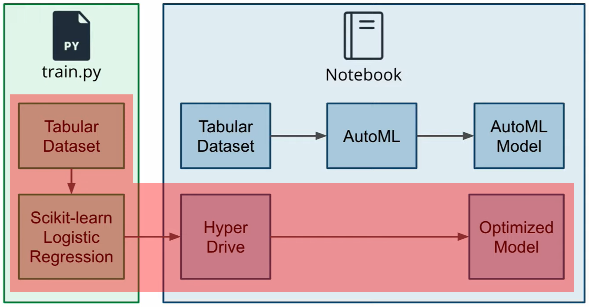
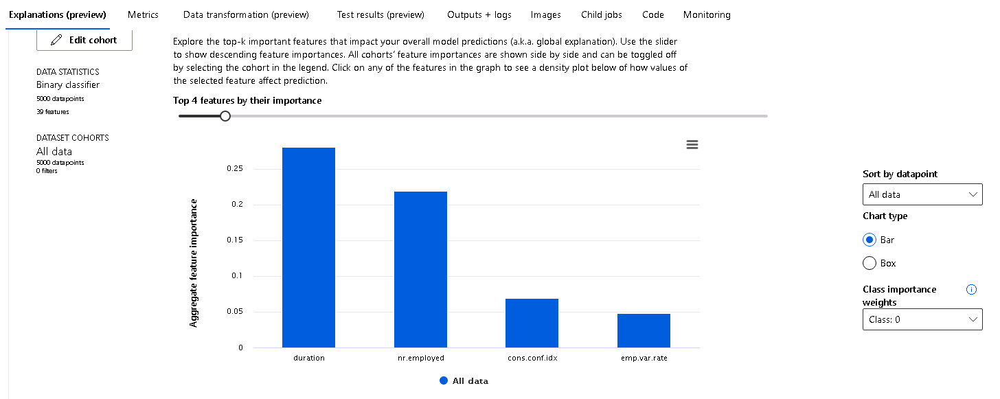

# Optimizing an ML Pipeline in Azure

## Overview
This project is part of the Udacity Azure ML Nanodegree.
In this project, we build and optimize an Azure ML pipeline using the Python SDK and a provided Scikit-learn model.
This model is then compared to an Azure AutoML run.

## Useful Resources
- [ScriptRunConfig Class](https://docs.microsoft.com/en-us/python/api/azureml-core/azureml.core.scriptrunconfig?view=azure-ml-py)
- [Configure and submit training runs](https://docs.microsoft.com/en-us/azure/machine-learning/how-to-set-up-training-targets)
- [HyperDriveConfig Class](https://docs.microsoft.com/en-us/python/api/azureml-train-core/azureml.train.hyperdrive.hyperdriveconfig?view=azure-ml-py)
- [How to tune hyperparamters](https://docs.microsoft.com/en-us/azure/machine-learning/how-to-tune-hyperparameters)


## Summary
The open [bankmarketing dataset](https://automlsamplenotebookdata.blob.core.windows.net/automl-sample-notebook-data/bankmarketing_train.csv) includes information about bank clients and how they response to a marketing campaign via phone calls. These responses can be either 'Yes' or 'No'. That means we have a binary classification problem here in order to predict if the client will subscribe a term deposit. 
The dataset includes 20 features (like age or job) of 32.950 clients and the class label ('yes' or 'no') in the last column.

The highest accuracy was achieved by an automatic generated model with the `VotingEnsemble` algorithm via AutomML with a metric of **91.75%**. In comparison, the hyperparameter tuning using Hyperdrive with an underlying `LogisticRegression` model reached an accuracy of **90.91%**.

## Scikit-learn Pipeline

The architecture contains of two elements: 


- The Pyhton scripts (`train.py`) includes the `Scikit-learn` model, functions to  read the dataset from the URL and saving it as `TabularDatasetFactory` object, cleaning the dataset, splitting it into training and test data und receiving the final metric score.
- The Jupyter Notebook is hosted on a compute instance and automates the steps in order to tune the hyperparameters of the `LogisticRegression` model. To do so, it creates the compute clusters, specifies the configuration of the hyperparameter tuning engine and runs the experiment.

### Parameter Sampler
In the Notebook, a parameter sampler of the Class [RandomParameterSampling](https://learn.microsoft.com/en-us/python/api/azureml-train-core/azureml.train.hyperdrive.randomparametersampling?view=azure-ml-py) was chosen which supports discrete and continuous hyperparameters. It was specified as follows:
```
ps = RandomParameterSampling( {
    "--C" : uniform(0.1,1),
    "--max_iter" : choice(50, 100, 150, 200)
    }
)
```
The [documentation](https://scikit-learn.org/stable/modules/generated/sklearn.linear_model.LogisticRegression.html) says about the parameters:
- `C` (float): Inverse of regularization strength; must be a positive float. That means, we need a continuous variable here, sampled via the `uniform` method.
- `max_iter` (int): Maximum number of iterations taken for the solvers to converge. For this, I used a discrete variable with the `choice` function.
With limiting the range of possible parameters, I was able to shrink the training resources and time.

### Early Stopping Policy
The [BanditPolicy](https://learn.microsoft.com/en-us/python/api/azureml-train-core/azureml.train.hyperdrive.banditpolicy?view=azure-ml-py) defines an early termination policy based on slack criteria, and a frequency and delay interval for evaluation. Any run that doesn't fall within the slack factor of the evaluation metric with respect to the best performing run will be terminated.
The policy was implemented in the notebook as you can see below:
```
policy = BanditPolicy(
    evaluation_interval=1, 
    slack_factor=0.1,
    delay_evaluation=4
)
```
The policy automatically terminates poorly performing runs and improves computational efficiency so I prevented my training procedure to deal with not promising hyperparameters.

### Results
The experiment overview including the Parameter Sampler and the Stopping Policy from above is as follows:


Via HyperDrive the hyperparameter were tuned und the resulting accuracies were compared until the stopping policy terminates the procedure. Some runs are shown below:


The best performing model was parametrized with a **Regularization Strength** (`--C`) of 0.9711269 and **Max. Iterations** (`--max_iter`) of 100. It has an accuracy of 90.91 % as you can see in the following:


## AutoML
AutoML is a new feature of the Azure Cloud to automate the time consuming, iterative tasks of machine learning model development. In contrast to Hyperparameter tuning with HyperDrive, you don't need a model which is specified by the ML engineer before the training. Rather AutoML finds a model by using different algorithms and parameters trying to improve the specified metrics.

The orchestration is done in the same Notebook, but you do not need a training script here. 

In the first step I received the data from the same URL  above. The splitting of the dataset into training and test data in the same ratio as with HyperDrive was done with the `random_split` method of `TabularDatasetFactory` class. 
The AutoML engine only works with a cleaned training dataset. For this reason, I used the `clean_data` method from the `train.py` script.

The implemented AutoML Config looks as follows:
```
automl_config = AutoMLConfig(
    experiment_timeout_minutes=25,
    task='classification',
    primary_metric='accuracy',
    training_data=train_data_cleaned,
    label_column_name='y',
    n_cross_validations=3
)
```
With the `experiment_timeout_minutes` parameter the procedure of finding an optimal model  limited. Here, 25 minutes were enough to beat the model tuned by HyperDrive. The `label_column_name` parameter was set `y` which is the column header of the labels in the dataset.

### Results
The final experiment overview is as follows:


AutoML tried out several models with different algorithm to maximize the given metric:


The best performing model is based on the `VotingEnsemble` algorithm and has an accuracy of 91.75 %. The Azure ML Workspace provides diagrams for many metrices. Some interesting ones are shown below:


Another advantage of the ML Workspace is the visualization of the most important features in the classification process:


## Pipeline comparison
Both pipelines used the same original dataset which was splitted in the same ratio. With an accuracy of 91.75 % the AutoML model was slightly better than the HyperDrive tuned one with an accuracy of 90.91 %.
Even though the accuracies were approx. the same, the architecture of both approaches differ from each other. Whereas a custom-coded model is required and only the hyperparameters are tuned via HyperDrive in a specified range, you do not need this effort when using AutoML. For the second mentioned you only need to set up the config of the engine and AutoML provides you a comprehensive model interpretation as shown in the last [subchapter](#results-1).

## Future work
AutoML as well as HyperDrive provide good results in general. Some points might be mentioned here:
1. The datasets were splitted in the **same ratio but not with the same data in training and test set** for HyperDrive and AutoML approach. These were randomly chosen.
2. The experiments were time-consuming and were stopped after a certain amount of time. It can be considered to use **GPUs instead of CPU clusters** to speed up in the future.
3. For HyperDrive there are **several opportunities for setting up a parameter sampler and a stopping policy**. Different approaches could be compared in order to gain better results.
4. In the [AutoML interpretation](#results-1) you can recognize that the **False Negatives** ratio is almost 50 % which is quite high.

## Proof of cluster clean up
To not waste unused resources the compute cluster is deleted in the last step of the Jupyter Notebook.
```
compute_cluster.delete()
```
The ongoing deleting process could be followed along in the ML Workspace:

